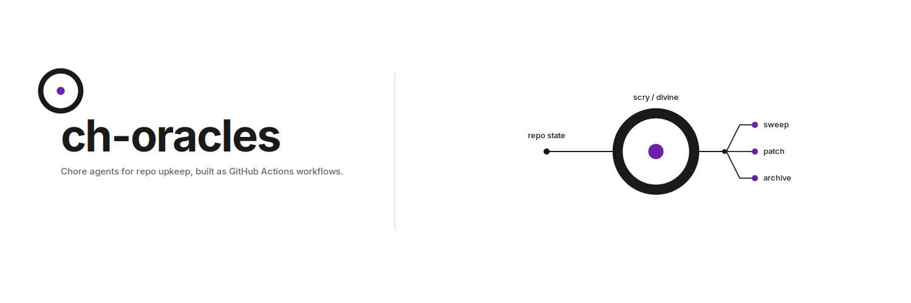

<picture>
  <source media="(prefers-color-scheme: dark)" srcset="./docs/assets/png/banner-dark.png">
  <source media="(prefers-color-scheme: light)" srcset="./docs/assets/png/banner-light.png">
  
</picture>

# ch-oracles

Polyglot chore agent suite for GitHub Actions. Sibling to
[norrietaylor/spectacles](https://github.com/norrietaylor/spectacles); stands
alone or installs alongside it.

## What it does

Hosts reusable `gh-aw` workflows that watch a repository for routine
maintenance work, then file issues or open PRs to address it:

- **chore-style-{rust,python,go,toml,ncl}** — formatter and linter audits per
  language, in `report` mode (files an issue) or `autofix` mode (opens a PR).
- **docs-patrol** — detects documentation drift against source.
- **test-coverage-detector** — flags high-complexity untested functions.
- **dependency-review** — surfaces advisory and semver drift.
- **trivial-dep-bump-{rust,python,go}** — opens auto-merge PRs for
  patch-level dependency updates that pass the per-language safety checks.
- **pr-conflict-resolver** — detects merge conflicts on open PRs and emits a
  rebase PR; idempotent and `needs-human`-gated.
- **worker-fix** / **worker-iterate** — workers that pick up `agent:*`
  issues, build and verify the repo in any supported language, and open or
  iterate fix PRs.

Audit and lint chores run on Copilot. Workers run on Claude.

## Install

```bash
curl -fsSL https://raw.githubusercontent.com/norrietaylor/ch-oracles/main/scripts/quick-setup.sh \
  | bash -s -- --suite oracles
```

By default the script auto-detects the consumer repo's language(s) by
manifest sniff (`Cargo.toml`, `pyproject.toml`, `go.mod`, presence of
`*.toml` or `*.ncl` files) and installs only the matching lint wrappers.

Filter explicitly:

```bash
./quick-setup.sh --suite oracles --languages rust,python --with-workers
```

See `docs/install.md` for full options.

## Coexistence with spectacles

ch-oracles can be installed in the same repository as spectacles. Their
wrapper files, lock files, and label namespaces do not collide; `AGENTS.md`
and `labels.yml` updates are additive. See `docs/coexistence-with-spectacles.md`.

## Architecture

Workflows are Markdown sources in `workflows/` with `gh-aw` frontmatter,
compiled to self-contained `.lock.yml` files in `.github/workflows/`.
Consumer repos install thin `wrappers/*.yml` files that call the hosted lock
files via `uses:`. Shared prompt fragments live in `shared/` and are inlined
at compile time.

See `docs/architecture.md` for the full chore → issue → worker → PR loop.

## License

MIT
