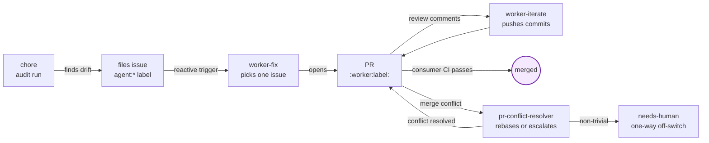
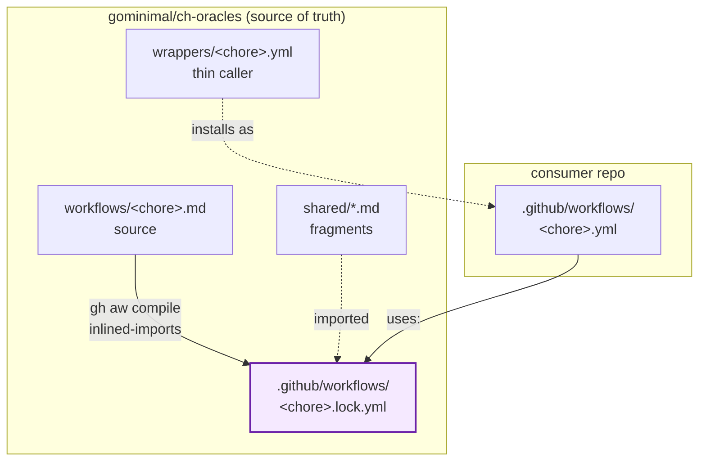
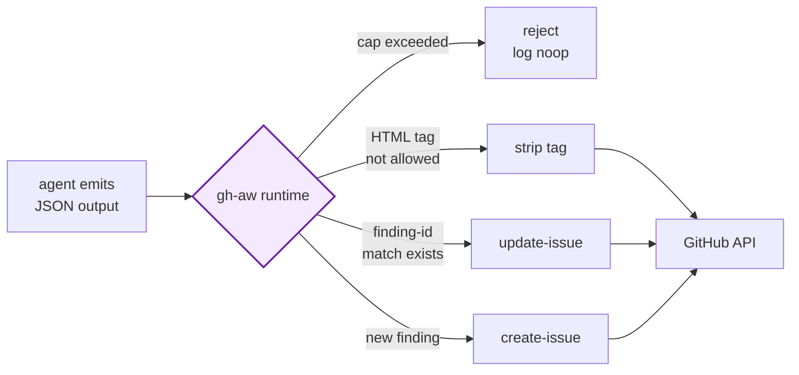
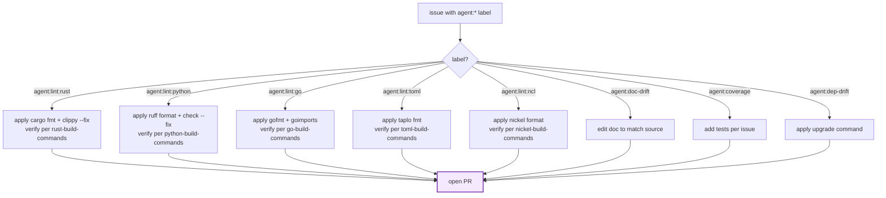
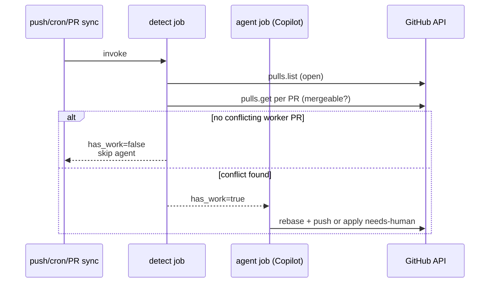

# Architecture

ch-oracles workflows follow a consistent loop: a chore detects something,
files an issue with a typed label, a worker picks the issue up and opens
a PR, and the consumer's existing CI gates the merge.

## The chore → issue → worker → PR loop



Every safe output (issue, PR, comment, label) is capped by gh-aw's
safe-output runtime — never raw GitHub API calls from the agent.

## Distribution model



ch-oracles hosts the heavy `.lock.yml` files. Consumers install only the
thin `.yml` wrappers via `quick-setup.sh`. Upgrades pull a newer release
tag.

## Compile-time vs runtime

- **Compile-time:** `gh aw compile workflows/*.md` inlines every imported
  fragment (`shared/*.md`) and produces a self-contained
  `.github/workflows/<name>.lock.yml`. Network egress allowlists,
  safe-output caps, and tool allowlists are baked into the lock at compile
  time.
- **Runtime:** wrappers in consumer repos invoke
  `uses: gominimal/ch-oracles/.github/workflows/<name>.lock.yml@<ref>`.
  The lock file's pre-activation guards (role check, label-namespace gate)
  evaluate the consumer's event context. The agent step runs in a sandbox
  with the baked allowlists.

## Safe-outputs gate



The agent never invokes the GitHub API directly. Every chore that writes
an issue, PR, comment, or label goes through the safe-output gate.

## Per-finding dedup

A chore's issue body always starts with:

```html
<!-- finding-id: <chore>::<lang>::<identity> -->
```

Before emitting `create-issue`, the agent searches for an existing open
issue with a matching marker; if found, it emits `update-issue` instead.
This prevents duplicate filings across scheduled runs and across reruns
after `workflow_dispatch`.

## Worker switch table

`worker-fix.md` reads the candidate issue's `agent:*` label and routes to
a language-aware fix path:



Verification commands per language come from
[`shared/build-matrix.md`](https://github.com/gominimal/ch-oracles/blob/main/shared/build-matrix.md),
with consumer `AGENTS.md` overrides taking precedence.

## pr-conflict-resolver detect job



The cheap non-LLM `detect` job scans for open worker PRs with
`mergeable: false`. The expensive agent job only fires when actual work
exists; on a quiet repo, scheduled ticks cost ~one API page and zero
model tokens.

## needs-human as a one-way off-switch

When the conflict resolver hits a non-trivial merge conflict, it applies
the `needs-human` label and stops. Both ch-oracles and (when co-installed)
spectacles workers honor `needs-human` as a one-way off-switch: a labeled
item is off-limits to every chore until a human removes the label.

This makes `needs-human` the canonical cross-suite "stop" signal in a
co-installed repo.
