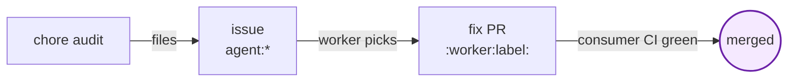

# ch-oracles

A polyglot chore agent suite for GitHub Actions. Watches a repository for
routine maintenance work — lint drift, doc drift, untested code, vulnerable
dependencies, merge conflicts — and files issues or opens PRs to address it.

Built on [gh-aw](https://github.com/githubnext/gh-aw). Sibling to
[norrietaylor/spectacles](https://github.com/norrietaylor/spectacles); stands
alone or co-installs with it.



## What's in the suite

| Chore | Output | Cadence |
|---|---|---|
| `chore-style-{rust,python,go,toml,ncl}` | Issue (report) or PR (autofix) per lint finding | Weekly + manual |
| `docs-patrol` | Issue per documentation drift | Weekly + on-push |
| `test-coverage-detector` | Up to 3 issues per high-complexity untested function | Weekly |
| `dependency-review` | Issue per advisory or major-version drift | Twice-weekly |
| `trivial-dep-bump-{rust,python,go}` | Auto-merge PR with patch-level bumps | Daily |
| `pr-conflict-resolver` | Rebases worker PRs on conflict; escalates non-trivial conflicts | Push + 6h backstop |
| `worker-fix` | Draft PR fixing one `agent:*` issue | Daily + reactive |
| `worker-iterate` | Push follow-up commits to worker PRs on review feedback | Reactive |

## Engine

The whole suite — chores and workers — runs on `engine: copilot`. A single
inference secret (`COPILOT_GITHUB_TOKEN`) backs every workflow.

See [ADR 0008](https://github.com/norrietaylor/ch-oracles/blob/main/decisions/0008-single-engine-copilot.md)
for the rationale (and [ADR 0006](https://github.com/norrietaylor/ch-oracles/blob/main/decisions/0006-engine-split.md)
for the prior two-engine arrangement it supersedes).

## Get started

```bash
curl -fsSL https://raw.githubusercontent.com/norrietaylor/ch-oracles/main/scripts/quick-setup.sh \
  | bash -s -- --suite oracles
```

See [Install](install.md) for full options.

## Design principles

- **Not gating.** Chore output is advisory; branch protection depends on
  consumer CI only ([ADR 0001](https://github.com/norrietaylor/ch-oracles/blob/main/decisions/0001-not-gating.md)).
- **Capped.** Audit chores file at most 1 issue per run (3 for coverage);
  fix chores open at most 1 PR per run. Per-finding dedup via finding-id
  markers prevents duplicate filings on re-runs.
- **Polyglot-aware.** Workers detect language per-run and use the
  appropriate build/test/lint commands. Consumer repos can override via
  `AGENTS.md` or `vars.CH_ORACLES_LANGUAGE`.
- **Standalone or co-installable.** Designed to work with or without
  [spectacles](https://github.com/norrietaylor/spectacles) in the same
  consumer repo.
